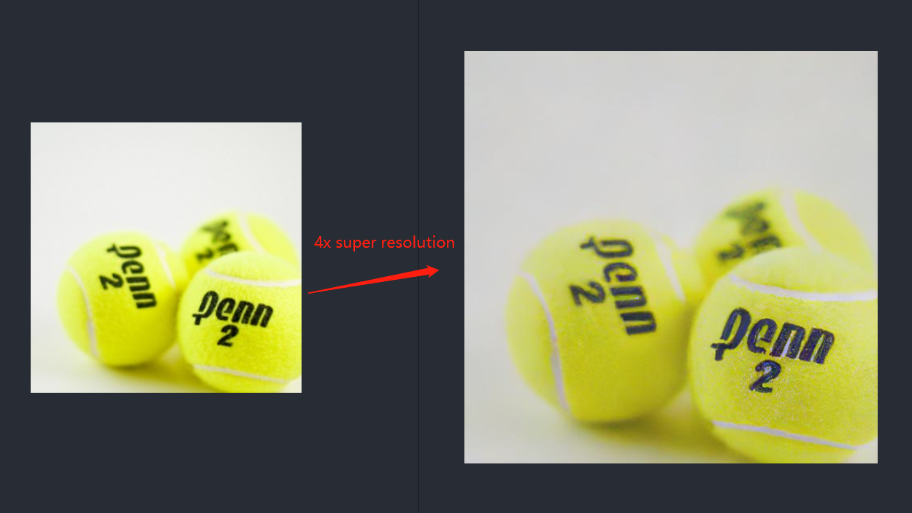

# OpenVINO C++ API - Super Resolution Async Demo
This repo provide a simple super resolution async c/c++ demo with OpenVINO on Intel CPU, It enhances the resolution of the input image by a factor of 4. The [image-super-resolution](https://arxiv.org/abs/1807.06779) model use in this repo is download from [open_model_zoo](https://github.com/openvinotoolkit/open_model_zoo). 

### Reference Model
- [single-image-super-resolution-1032](https://github.com/openvinotoolkit/open_model_zoo/tree/master/models/intel/single-image-super-resolution-1032)
- [single-image-super-resolution-1033](https://github.com/openvinotoolkit/open_model_zoo/tree/master/models/intel/single-image-super-resolution-1033)
- [text-image-super-resolution-0001](https://github.com/openvinotoolkit/open_model_zoo/tree/master/models/intel/text-image-super-resolution-0001)

### Model Inputs 
1. Image, name: 0, shape: 1, 3, 270, 480 in the format B, C, H, W, where:
    - B - batch size
    - C - number of channels
    - H - image height
    - W - image width
2. Bicubic interpolation of the input image, name: 1, shape: 1, 3, 1080, 1920 in the format B, C, H, W, where:
    - B - batch size
    - C - number of channels
    - H - image height
    - W - image width
Expected color order is BGR.

### Model Outputs
The net output is a blob with shapes 1, 3, 1080, 1920 that contains image after super resolution.

### Pre-requirtment Install
- OpenVINO
    - [Install by source code](https://github.com/openvinotoolkit/openvino/wiki/BuildingForLinux)
    - [Install by APT](https://docs.openvino.ai/nightly/openvino_docs_install_guides_installing_openvino_apt.html)

## Super Resolution Demo 
Make sure OpenVINO and related dependencies are inetalled before running this demo.

Step 1. Initialize environment 
```
source <OPENVINO_INSTALL_PATH>/setupvars.sh
```

Step 2. Download super-resoluation model by open_model_zoo
```
omz_downloader --name single-image-super-resolution-1032 -o <MODEL_PATH>
```

Step 3. Compile demo source code
```
./build_demos.sh
```

Step 4. Run super resolution pipeline 
```
./omz_demos_build/intel64/Release/image_processing_demo -at sr -m <MODEL_PATH>/intel/single-image-super-resolution-1032/FP16-INT8/single-image-super-resolution-1032.xml -i <IMAGE_PATH>
```

## Super Resolution Result
